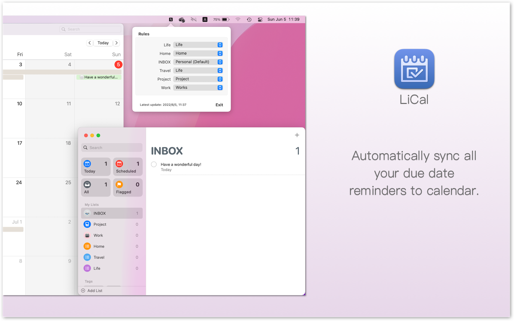
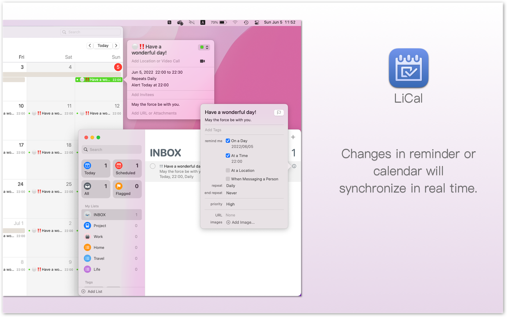
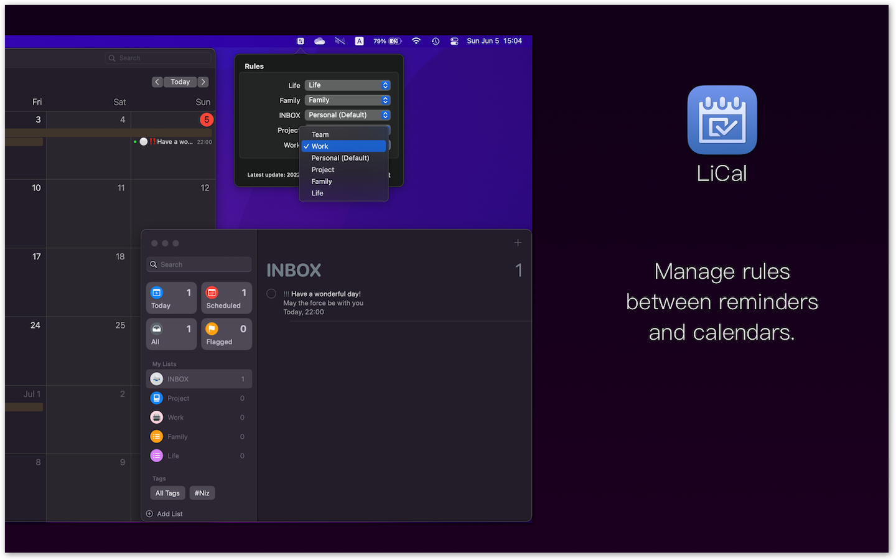
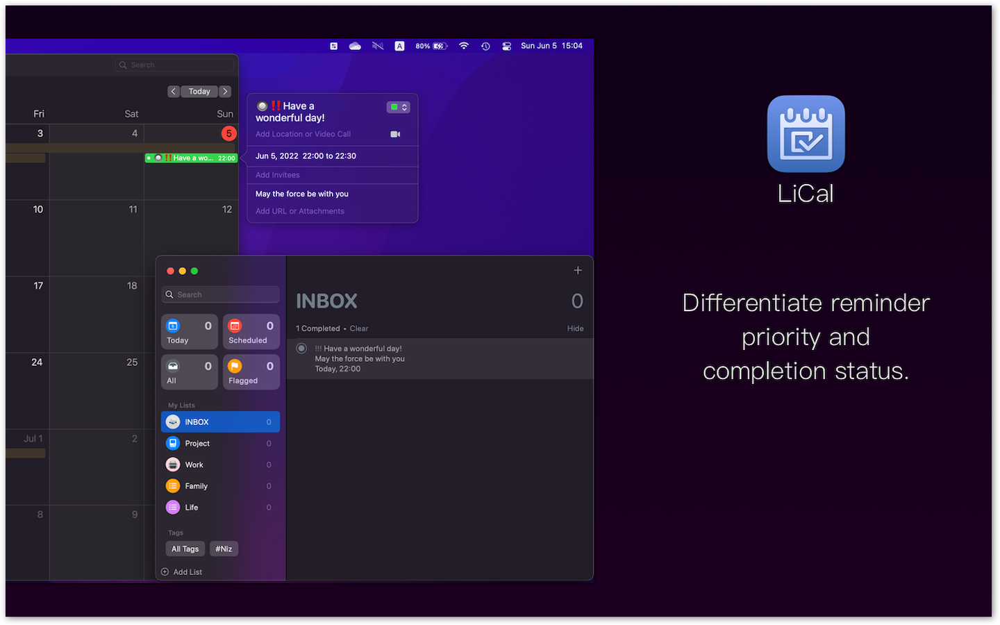

## About LiCal

LiCal app automatically synchronize all the tasks(with due date) in Reminders app to Calendar app.

To keep your data secure, LiCal use MacOS native features and works without internet connection. 

## Features

- Create event in calendar when you add new reminder(with due date).
- Update event when related reminder has changed.
- Update reminder when related event has changed.
- Delete event when related reminder has removed.
- Delete event when related reminder's due date has removed.
- Manage synchronization rules between reminders and calendar.

## Upcomming Features

- More options for synchronization rules.
- More Calendar apps and ToDo apps support.

## Support or Contact

mail: licalapp@laconiks.tech
